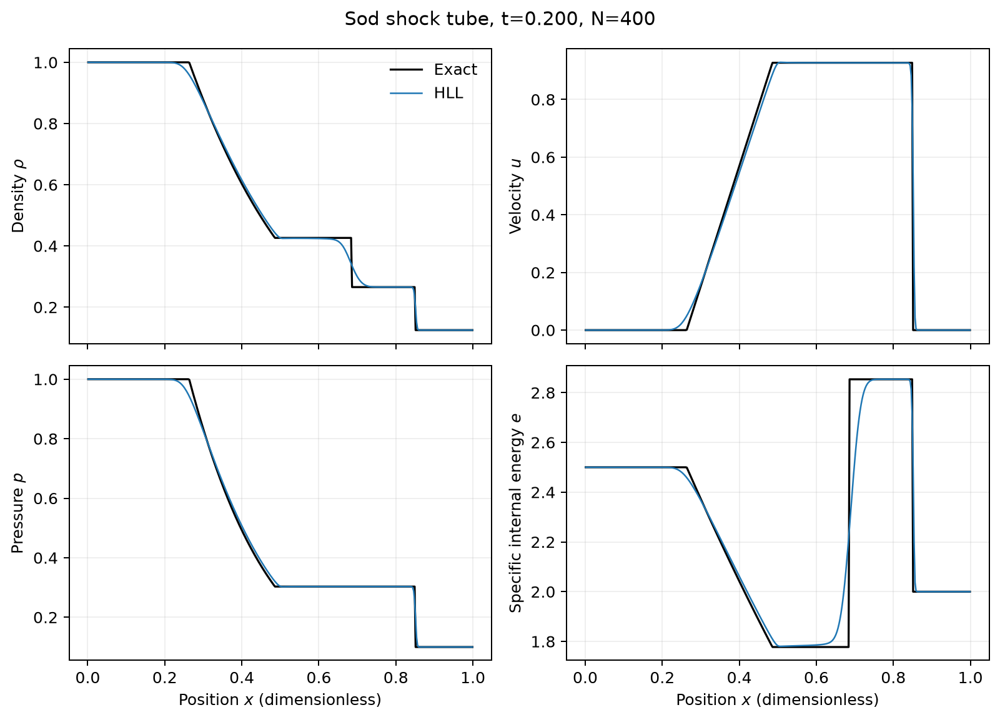

# Astrophysical Hydrodynamics

A compact, validation-driven finite-volume code for compressible astrophysical
fluid dynamics. Development begins with one-dimensional Euler shock tubes and
will progress to established two-dimensional instability and blast-wave
benchmarks. Numerical correctness, conservation, reproducibility, and explicit
limitations take priority over feature count.



The figure is generated by this repository at 400 cells and dimensionless time
`t = 0.2`; it is not illustrative or fabricated data.

## Equations

The current code solves the source-free one-dimensional compressible Euler
equations

$$
\frac{\partial}{\partial t}
\begin{pmatrix}\rho\\ \rho u\\ E\end{pmatrix}
+\frac{\partial}{\partial x}
\begin{pmatrix}\rho u\\ \rho u^2+p\\ u(E+p)\end{pmatrix}=0,
\qquad
p=(\gamma-1)\left(E-\frac{(\rho u)^2}{2\rho}\right).
$$

All quantities in the current benchmarks are dimensionless.

## Implemented methods

- cell-centred finite volumes on a uniform 1D grid;
- piecewise-constant (first-order Godunov) reconstruction;
- primitive-variable MUSCL reconstruction with minmod, monotonized-central,
  and van Leer slope limiters;
- selectable HLL, contact-restoring HLLC, and Rusanov approximate Riemann
  fluxes;
- selectable forward-Euler or two-stage SSP-RK2 integration with a
  configurable CFL timestep;
- transmissive/outflow and periodic ghost-cell boundaries;
- primitive/conserved conversion with strict non-finite and positivity checks;
- an internal exact ideal-gas Riemann solution for shock-tube validation;
- mass, momentum, energy, boundary-flux-budget, positivity, and Mach-number
  diagnostics;
- reproducible Sod convergence and additional Riemann-problem benchmarks.

## Installation and use

Python 3.10 or newer is recommended.

```bash
python -m venv .venv
source .venv/bin/activate  # Windows PowerShell: .venv\Scripts\Activate.ps1
python -m pip install -e .
python examples/sod/run.py
```

The Sod script accepts `--cells`, `--time`, `--cfl`, and `--output`. By default
it writes `figures/sod_hll_first_order.png` and prints a JSON diagnostic report.

Run the other Riemann problems and the resolution study with:

```bash
python examples/run_riemann.py strong_shock --cells 400 --cfl 0.7
python examples/run_riemann.py contact_discontinuity --cells 400
python examples/run_riemann.py rarefaction --cells 400 --cfl 0.7
python benchmarks/convergence/sod.py
python benchmarks/convergence/entropy_wave.py
python benchmarks/reconstruction/compare.py
python benchmarks/riemann_solvers/compare.py
```

An individual second-order run can be made with, for example:

```bash
python examples/run_riemann.py sod --cfl 0.4 \
  --reconstruction muscl --limiter mc --integrator rk2
```

The numerical sanity checks can be repeated with:

```bash
python -m unittest discover -s tests -v
```

## Validation status

I first checked the basic building blocks independently: primitive/conserved
round trips, the ideal-gas pressure and sound speed, the Euler flux, HLL
consistency, ghost-cell filling, and preservation of a uniform moving flow. I
then ran four Riemann problems and compared every numerical profile with the
internal exact solution.

For the committed 400-cell Sod run at `t = 0.2`, the measured density
$L_1$ error against the internal exact solution is `6.750936e-3`. Mass and
total energy changes are zero to the reported floating-point precision, and
the minimum density and pressure remain at their initial positive values
(`0.125` and `0.1`). A 50--800 cell study shows monotonically decreasing
errors; over the 400-to-800 refinement, the measured orders are 0.661 for
density, 0.804 for velocity, and 0.772 for pressure. These sub-unity global
orders are expected for a discontinuous shock-tube solution and are not a
smooth-flow accuracy measurement. See [validation details](docs/validation.md).


For a smooth periodic entropy wave, the 128-to-256 cell observed density orders
are 1.864 (minmod), 1.969 (MC), and 2.038 (van Leer). MC reduces the 256-cell
density $L_1$ error from `9.614786e-3` for the first-order method to
`8.687254e-5`.


With MUSCL-MC/RK2 at 400 cells, the Sod density $L_1$ errors are
`1.496039e-3` (HLL), `1.446073e-3` (HLLC), and `1.872238e-3` (Rusanov). On the
translating contact, the corresponding 1--99% widths are `0.0275`, `0.0250`,
and `0.0275`. HLLC is sharper here, but the comparison does not support a
claim that one flux is best for every problem.


## Repository layout

```text
src/hydro/          physics, fluxes, solver, exact solution, diagnostics
examples/           reproducible Riemann drivers and plotting
tests/              compact numerical regression checks
benchmarks/         convergence data and future method/performance studies
docs/               equations, numerical methods, and validation record
figures/            generated scientific figures
```

## Current limitations

Only source-free 1D Euler flow is implemented. HLL remains diffusive at contact
waves even with MUSCL reconstruction. There is no positivity-preserving
fallback: an invalid state raises an exception for diagnosis. The exact solver
is a validation utility, not the evolution flux. No 2D flow, gravity, or
physical viscosity is implemented yet. The present second-order measurement
uses a smooth entropy wave; more smooth solutions would strengthen the formal
verification.

## Planned extensions

The next milestone is a clean 2D Euler extension with four conserved variables,
directional fluxes, multidimensional CFL control, and periodic, reflective, and
outflow boundaries. A uniform-flow and directionally rotated 1D problem should
be validated before starting Kelvin--Helmholtz, Rayleigh--Taylor, or
Sedov--Taylor calculations.

Licensed under GPL-3.0; see [LICENSE](LICENSE).
