# Astrophysical Hydrodynamics

A compact, validation-driven finite-volume code for compressible astrophysical
fluid dynamics. Development begins with one-dimensional Euler shock tubes and
now includes a validated second-order two-dimensional Euler core, smooth
Kelvin--Helmholtz and Rayleigh--Taylor instabilities, and a two-dimensional
Sedov--Taylor blast. Numerical correctness, conservation, reproducibility, and
explicit limitations take priority over feature count.

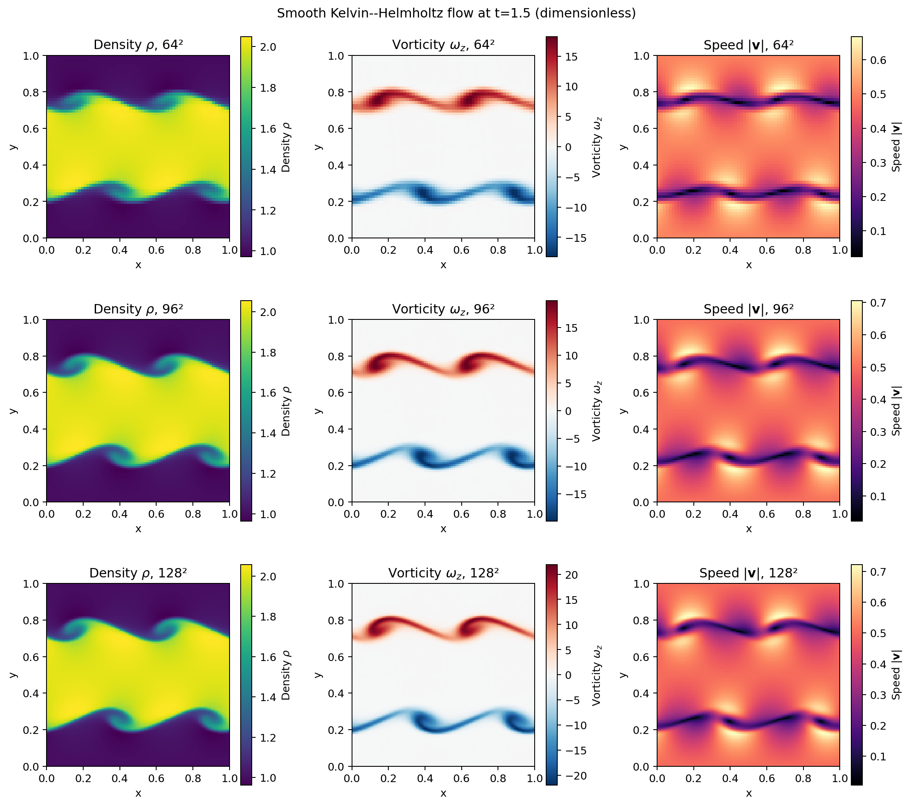

These fields were generated by this repository at dimensionless time `t = 1.5`;
they are measured outputs from the 64², 96², and 128² calculations.

## Equations

The current code solves the source-free compressible Euler equations. In one
dimension they are

$$
\frac{\partial}{\partial t}
\begin{pmatrix}\rho\\ \rho u\\ E\end{pmatrix}
+\frac{\partial}{\partial x}
\begin{pmatrix}\rho u\\ \rho u^2+p\\ u(E+p)\end{pmatrix}=0,
\qquad
p=(\gamma-1)\left(E-\frac{(\rho u)^2}{2\rho}\right).
$$

All quantities in the current benchmarks are dimensionless.

## Implemented methods

- cell-centred finite volumes on a uniform 1D grid;
- piecewise-constant (first-order Godunov) reconstruction;
- primitive-variable MUSCL reconstruction with minmod, monotonized-central,
  and van Leer slope limiters;
- selectable HLL, contact-restoring HLLC, and Rusanov approximate Riemann
  fluxes;
- selectable forward-Euler or two-stage SSP-RK2 integration with a
  configurable CFL timestep;
- transmissive/outflow and periodic ghost-cell boundaries;
- primitive/conserved conversion with strict non-finite and positivity checks;
- an internal exact ideal-gas Riemann solution for shock-tube validation;
- mass, momentum, energy, boundary-flux-budget, positivity, and Mach-number
  diagnostics;
- reproducible Sod convergence and additional Riemann-problem benchmarks;
- a conservative unsplit 2D Cartesian solver with piecewise-constant or
  direction-by-direction primitive MUSCL reconstruction, forward Euler or
  SSP-RK2, multidimensional CFL control, and directional HLL/HLLC/Rusanov
  fluxes;
- periodic, outflow, and reflective 2D boundaries.
- smooth double-shear Kelvin--Helmholtz initial conditions, cell-centred
  vorticity, transverse kinetic energy, and time-history diagnostics.
- constant 2D gravity with momentum and work source terms, hydrostatic wall
  pressure extrapolation, and gas-plus-potential-energy diagnostics;
- a smooth heavy-over-light Rayleigh--Taylor benchmark with matched
  zero-perturbation controls and interface-growth measurements.
- a finite-radius 2D Sedov--Taylor blast with exactly normalized injected
  energy, radial profiles, shock-radius scaling, and angular symmetry metrics.

## Installation and use

Python 3.10 or newer is recommended.

```bash
python -m venv .venv
source .venv/bin/activate  # Windows PowerShell: .venv\Scripts\Activate.ps1
python -m pip install -e .
python examples/sod/run.py
```

The Sod script accepts `--cells`, `--time`, `--cfl`, and `--output`. By default
it writes `figures/sod_hll_first_order.png` and prints a JSON diagnostic report.

Run the other Riemann problems and the resolution study with:

```bash
python examples/run_riemann.py strong_shock --cells 400 --cfl 0.7
python examples/run_riemann.py contact_discontinuity --cells 400
python examples/run_riemann.py rarefaction --cells 400 --cfl 0.7
python benchmarks/convergence/sod.py
python benchmarks/convergence/entropy_wave.py
python benchmarks/reconstruction/compare.py
python benchmarks/riemann_solvers/compare.py
python benchmarks/convergence/rotated_sod_2d.py
python benchmarks/convergence/entropy_wave_2d.py
python benchmarks/kelvin_helmholtz.py
python benchmarks/rayleigh_taylor.py
python benchmarks/sedov_taylor.py
```

An individual second-order run can be made with, for example:

```bash
python examples/run_riemann.py sod --cfl 0.4 \
  --reconstruction muscl --limiter mc --integrator rk2
```

The numerical sanity checks can be repeated with:

```bash
python -m unittest discover -s tests -v
```

## Validation status

I first checked the basic building blocks independently: primitive/conserved
round trips, the ideal-gas pressure and sound speed, the Euler flux, HLL
consistency, ghost-cell filling, and preservation of a uniform moving flow. I
then ran four Riemann problems and compared every numerical profile with the
internal exact solution.

For the committed 400-cell Sod run at `t = 0.2`, the measured density
$L_1$ error against the internal exact solution is `6.750936e-3`. Mass and
total energy changes are zero to the reported floating-point precision, and
the minimum density and pressure remain at their initial positive values
(`0.125` and `0.1`). A 50--800 cell study shows monotonically decreasing
errors; over the 400-to-800 refinement, the measured orders are 0.661 for
density, 0.804 for velocity, and 0.772 for pressure. These sub-unity global
orders are expected for a discontinuous shock-tube solution and are not a
smooth-flow accuracy measurement. See [validation details](docs/validation.md).

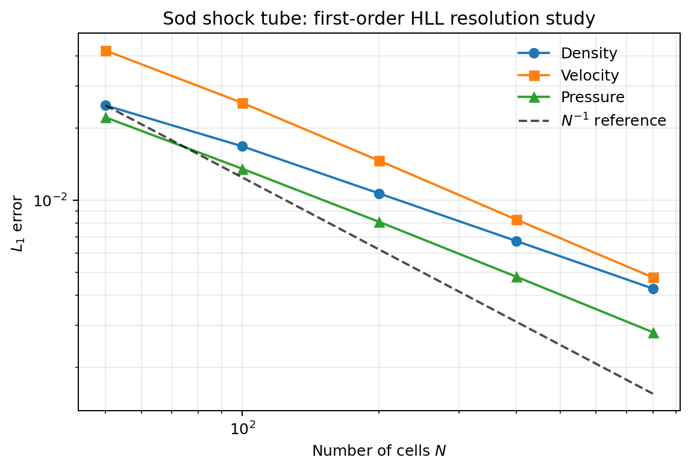

For a smooth periodic entropy wave, the 128-to-256 cell observed density orders
are 1.864 (minmod), 1.969 (MC), and 2.038 (van Leer). MC reduces the 256-cell
density $L_1$ error from `9.614786e-3` for the first-order method to
`8.687254e-5`.

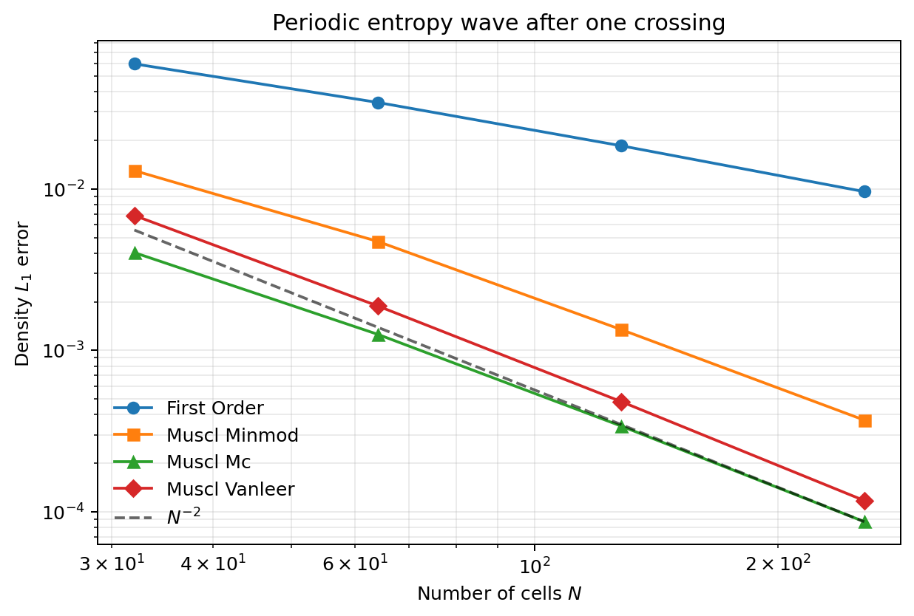

With MUSCL-MC/RK2 at 400 cells, the Sod density $L_1$ errors are
`1.496039e-3` (HLL), `1.446073e-3` (HLLC), and `1.872238e-3` (Rusanov). On the
translating contact, the corresponding 1--99% widths are `0.0275`, `0.0250`,
and `0.0275`. HLLC is sharper here, but the comparison does not support a
claim that one flux is best for every problem.

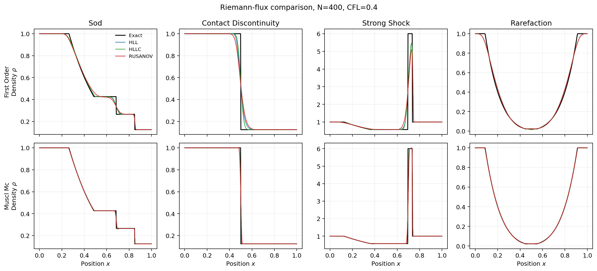

For the 2D core, a uniform periodic flow remained unchanged to reported
floating-point precision. Sod tubes normal to x and y matched exactly after
transposition and velocity-component exchange. Their centre-line density
$L_1$ error decreased from `2.418633e-2` at $32^2$ to `1.322181e-2` at
$128^2$.


I then advected a diagonal entropy wave with velocity $(0.7,0.3)$ for one
periodic crossing. At $64^2$, MUSCL-MC/RK2 reduced the density $L_1$ error to
`1.202684e-3`, compared with `6.401181e-2` for the first-order configuration.
The 32-to-64 observed orders were 1.698 for MC and 1.814 for van Leer. Periodic
mass, both momenta, and energy were conserved to at worst `3.7e-16` relatively.

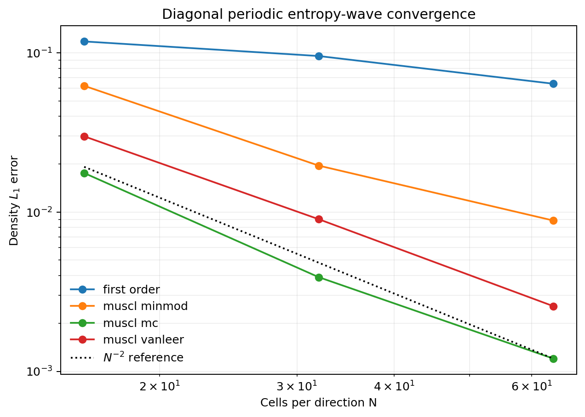

With MUSCL-MC/RK2, the rotated Sod density error fell from `1.222166e-2` at
$32^2$ to `4.075024e-3` at $128^2$. The x- and y-normal results remained
identical under rotation, while the minimum density and pressure stayed at
`0.125` and `0.1` without floors.

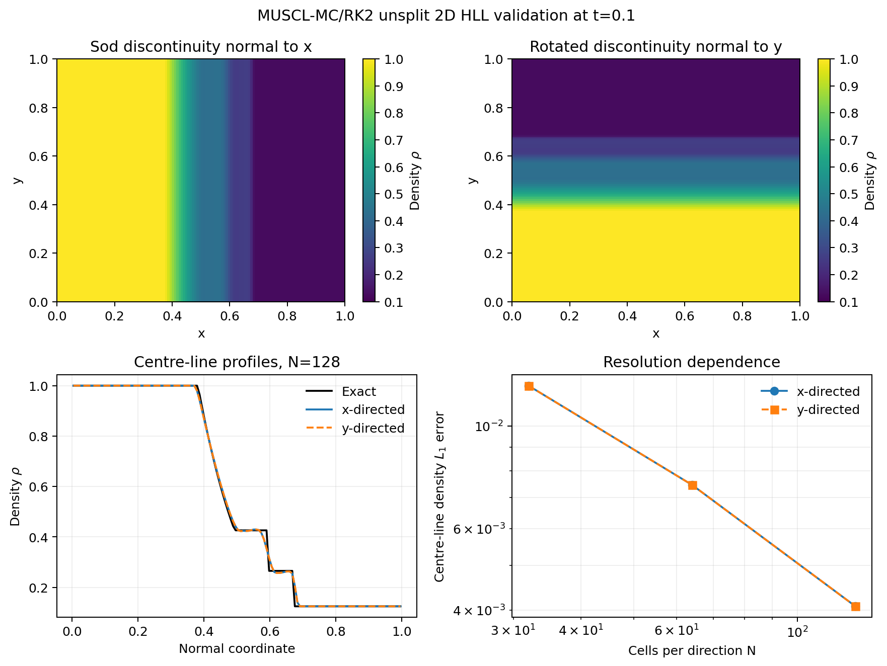

For the smooth Kelvin--Helmholtz calculation, I used periodic boundaries,
MUSCL-MC/RK2, HLLC, and CFL 0.35. At $t=1.5$, transverse kinetic energy had
grown from `6.646702e-6` to `3.973554e-3`, `5.839117e-3`, and `6.564919e-3`
at $64^2$, $96^2$, and $128^2$. The two finest RMS vertical velocities differ
by about 6%, while the coarsest result is visibly more diffusive. Mass and
energy changes stayed at or below `2.22e-16` and `8.88e-16` in absolute value.
This demonstrates instability growth and increasing roll-up, but not full
grid convergence.

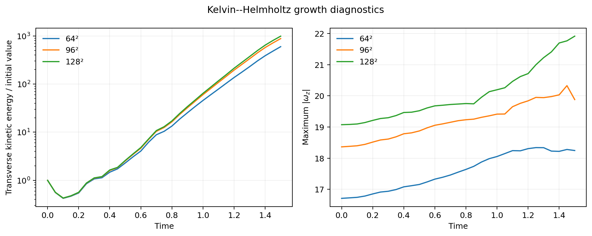

For Rayleigh--Taylor, I initialized a smooth density transition in analytic
hydrostatic balance under $g_y=-0.5$ and ran both perturbed and exactly
unperturbed controls. The fitted interface growth rates over $0.8\le t\le2.2$
were 1.410, 1.409, and 1.397 at $64^2$, $96^2$, and $128^2$. At $t=2.5$, the
two finest bubble heights differ by 1.4%, while the control RMS vertical
velocity falls from `1.395e-5` at $64^2$ to `2.359e-6` at $128^2$.

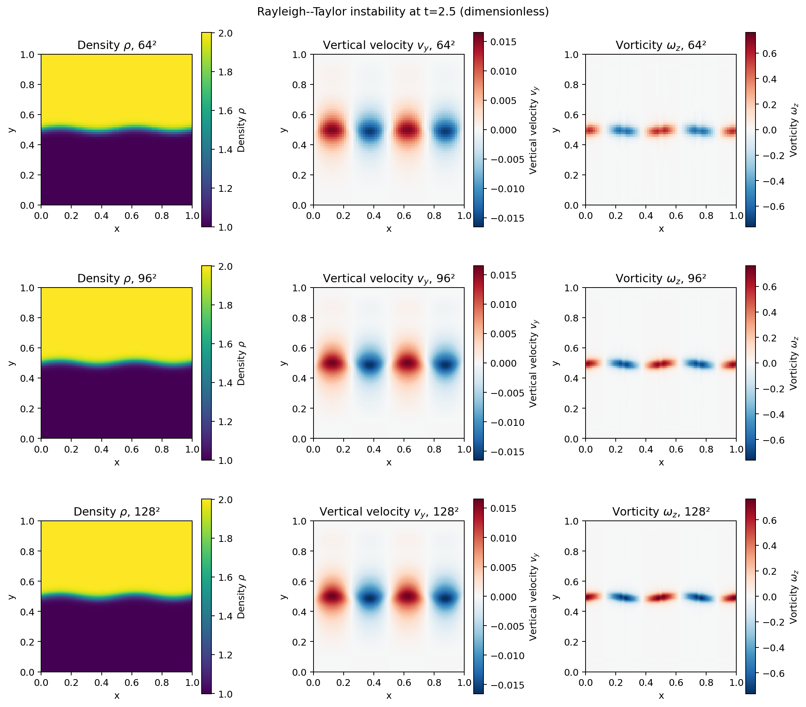

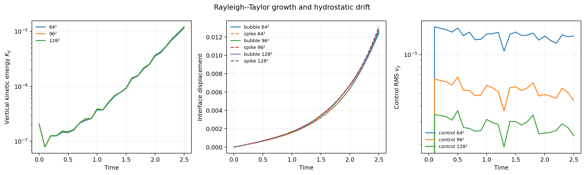

For the two-dimensional Sedov--Taylor blast, I deposited exactly one energy
unit through a compact kernel of radius 0.05 and followed the shock to
$t=0.05$. The fitted exponents in $R\propto t^\alpha$ were 0.463, 0.473, and
0.483 at $64^2$, $96^2$, and $128^2$, approaching the correct 2D value 0.5.
I also evaluated the closed-form cylindrical similarity solution. It gives
$R_s(0.05)=0.22451$; the measured radius error falls from 4.86% to 2.26% under
refinement. On the finest grid, density, radial velocity, and pressure profile
errors are 14.90%, 8.44%, and 8.89% in the radial $L_1$ measure. Angular radius
scatter falls from 1.61% to 0.80%, and total energy remained constant within
`2.23e-16` relatively.

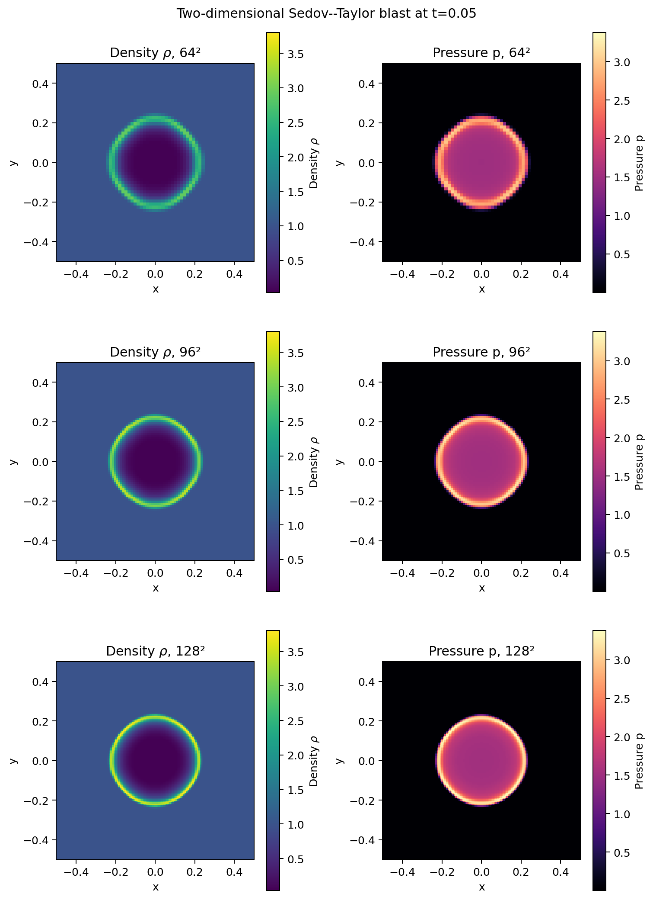

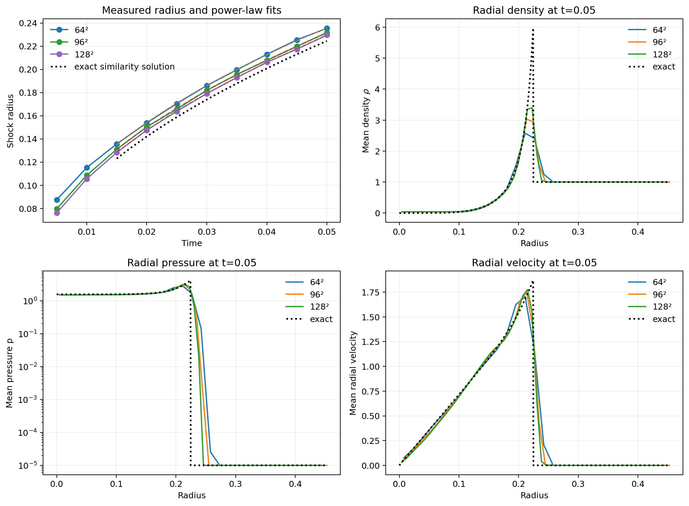

## Repository layout

```text
src/hydro/          physics, fluxes, solver, exact solution, diagnostics
examples/           reproducible Riemann drivers and plotting
tests/              compact numerical regression checks
benchmarks/         convergence data and future method/performance studies
docs/               equations, numerical methods, and validation record
figures/            generated scientific figures
```

## Current limitations

The 2D MUSCL reconstruction is direction-by-direction and does not include a
corner-transport or transverse predictor. The gravity discretisation is not
exactly well balanced, although its unperturbed drift decreases under
refinement. The Rayleigh--Taylor result remains in the linear-growth regime and
does not yet demonstrate nonlinear mushroom formation or a converged mixing
layer. There is no positivity-preserving fallback. Physical viscosity is not
implemented, so instability dissipation is numerical. The present smooth-order
measurements use entropy waves; more independent smooth solutions would
strengthen formal verification. The Sedov density shell remains broadened by
the finite-volume discretisation and the finite initial injection radius delays
the exact point-blast asymptotic regime.

## Planned extensions

The original 1D-to-2D benchmark sequence is now implemented. The strongest
next scientific extensions are longer nonlinear Rayleigh--Taylor and
higher-resolution Kelvin--Helmholtz studies. An exactly well-balanced gravity
scheme, optional physical viscosity, and performance profiling remain useful
method-development targets.

Licensed under GPL-3.0; see [LICENSE](LICENSE).
